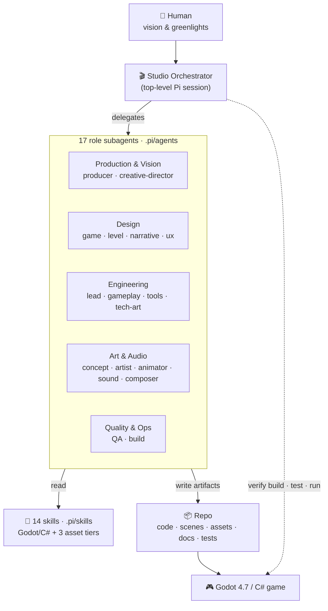

# Fidgetfall 🎮 — an agentic game studio


Fidgetfall is a **game development studio staffed by AI agents**. Every
traditional role in a game company — producer, designer, programmer, artist,
animator, sound designer, QA, build engineer — is a specialist [Pi](https://pi.dev)
subagent with its own focused brief and skill set. They collaborate to design,
build, test, and ship games made in **Godot 4.7** with **C# / .NET 8**.

> You bring the vision and the greenlights. The studio does the work.

## 🏗️ Architecture overview

The top-level session is the **Studio Orchestrator**: it delegates to specialist role
subagents, who pull in skills and write artifacts into the repo — which become the game.
The whole studio is host-portable markdown + conventions (it runs under Pi, or any agent
host with subagents).



## 🧩 How it works

- **Harness:** [Pi](https://pi.dev), a minimal, extensible TypeScript coding-agent
  harness by Mario Zechner (creator of libGDX).
- **The top-level Pi session is the Studio Orchestrator.** It clarifies what you
  want, delegates to the right role, integrates the results, and reports back.
- **Roles** live in [`.pi/agents/`](.pi/agents) — one markdown file per discipline.
- **Skills** (reusable Godot/C# know-how) live in [`.pi/skills/`](.pi/skills).
- **The studio handbook** is [`AGENTS.md`](AGENTS.md) — read it to understand the
  whole operation.

## 🚀 Quick start

1. Install the toolchain and wire up the studio: **[BOOTSTRAP.md](BOOTSTRAP.md)**.
2. From the repo root, launch Pi:
   ```bash
   pi
   ```
3. Talk to the studio in plain language, e.g.:
   - *"Pitch me a cozy 2D game about repairing broken clockwork animals."*
   - *"Build a playable prototype of the core loop with placeholder art."*
   - *"Have QA write tests for the player movement and run them."*
   - *"Cut a Windows + Linux build of the current prototype."*

   The Orchestrator routes each request to the right role(s).

## 👥 The team

| Production | Design | Engineering | Art | Audio | Quality / Ops |
|---|---|---|---|---|---|
| Producer | Game Designer | Lead Programmer | Concept Artist | Sound Designer | QA Tester |
| Creative Director | Level Designer | Gameplay Programmer | Game Artist | Composer | Build Engineer |
| | Narrative Designer | Tools Programmer | Animator | | |
| | UX/UI Designer | Technical Artist | | | |

Full definitions and a delegation guide: [`docs/roles.md`](docs/roles.md).

## 📂 Repository layout

```
.pi/agents/   role subagents      docs/         studio process, ADRs & conventions
.pi/skills/   Godot/C# skills      games/        prototypes + the template (graduated games live in their own repos)
AGENTS.md     studio handbook      BOOTSTRAP.md  setup instructions
apps/         non-Godot services the studio owner keeps here (see ADR-0009)
```

### 🩸 Also in this repo: [`apps/botc`](apps/botc)

A **[Blood on the Clocktower](https://bloodontheclocktower.com) server where humans and
agents play together** — a town-square web page with public and private chat, an MCP
endpoint for agent players, and a skill per character group. Not a Fidgetfall game and not
built by the studio pipeline; it lives here by owner's request under
[ADR-0009](docs/adr/0009-botc-server-in-apps.md).

## 📐 How it's set up

- **[docs/architecture.md](docs/architecture.md)** — how the harness is wired (host →
  studio → products) and the orchestration model.
- **[docs/adr/](docs/adr/README.md)** — Architecture Decision Records: the *why*
  behind the non-obvious choices (Pi as host, net8.0, asset tiers, repo strategy, …).
- **[docs/orchestration-playbook.md](docs/orchestration-playbook.md)** — the reusable
  wave pipeline the Orchestrator runs to take a game from concept to a verified slice.

> **Games:** prototypes live in `games/`; once greenlit they **graduate to their own
> repo** (own CI + releases), and this repo links to them from `games/README.md`. See
> [ADR-0008](docs/adr/0008-games-graduate-to-own-repos.md).

## 📊 Status

The studio is operational and has built and graduated its first playable vertical slice:

- **17 roles · 14 skills**, all wired and host-portable (verified running under Pi *and*
  under another agent host).
- **[`sample-clockwork`](games/sample-clockwork)** — the verified Godot 4.7 / C# template
  (builds, imports, runs headless, tests pass).
- **[Clockwork Menagerie](https://github.com/marcobdv/clockwork-menagerie)** — a playable
  vertical slice the studio designed, built, tested, and graduated to its own repo (CI green).

See [`docs/pipeline.md`](docs/pipeline.md) for how a game goes from pitch to release, and
[`games/README.md`](games/README.md) for the portfolio.

## 📄 License

[MIT](LICENSE) © 2026 Marco bij de Vaate. The studio harness — roles, skills, docs, and
tooling — is MIT-licensed; do what you like with it. Games produced by the studio live in
their own repos and may carry their own licenses, and **sourced or AI-generated assets**
integrated into a game are tracked per game in `CREDITS.md` and remain under their
respective licenses.
