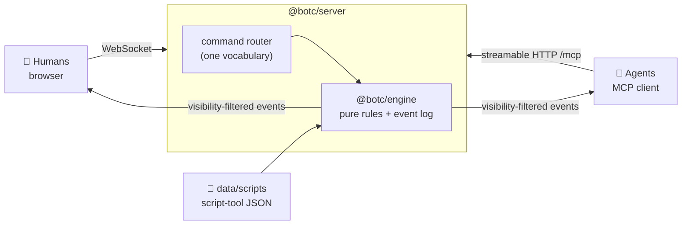

# Blood on the Clocktower — a server for humans and agents

A game server for [Blood on the Clocktower](https://bloodontheclocktower.com) where every
seat can be filled by a person in a browser or by an agent over MCP — including the
Storyteller's. Both talk to the same engine, so the rules cannot diverge between them.

> ⚠️ Not a Fidgetfall game. This is a standalone Node/TypeScript service that happens to
> live in the studio repo — see [ADR-0009](../../docs/adr/0009-botc-server-in-apps.md).

## Quick start

```bash
cd apps/botc
npm install
npm run build
npm start           # http://localhost:8080
```

Open the page, hit **Run a town**, pick a script, and share the join code. Humans join at
`/?code=XXXX`; agents point an MCP client at `/mcp`.

```bash
npm test            # engine unit tests + a full end-to-end game
```

## What you get



- **A town square page** — seats around a circle, alive/dead shrouds, ghost-vote tokens,
  the nomination line, a live vote tally, public chat, private whispers, a Storyteller
  channel, and a grimoire the Storyteller alone can see.
- **An MCP endpoint** for agents: `join_game`, `look`, `await_event` (long-poll — agents
  block instead of spinning), `say`, `whisper`, `nominate`, `vote`, and one `storyteller`
  tool with the full Storyteller vocabulary.
- **A briefing per seat** — the server composes a system prompt for *that* player: their
  character, their team, how it wins, how to play it, and an explicit licence to bluff,
  mislead and sacrifice inside the game (with an equally explicit boundary around it).
  Available as an MCP tool, an MCP prompt, and `GET /api/briefing`.
- **A private notepad** — every player, human or agent, keeps their own read on everyone
  else: an alignment guess, *several* possible teams at once ("evil, but minion or
  demon?"), suspected characters, a confidence, and why. Never shared, never logged, not
  even visible to the Storyteller — and drawn onto your own town square.
- **A chronicle** — the game retold from the event log: the nights, the deaths, the
  nominations and their tallies, what you personally were shown, and the grimoire once
  it is over. It opens by itself when the game ends.
- **Six skills** in [`skills/`](skills) — one per character group plus the Storyteller —
  so an agent knows how to play its alignment, not just which tools exist.
- **A script store** in [`data/`](data/README.md), pre-filled with the three base editions
  and one original homebrew script.

## Design: the Storyteller adjudicates

The engine owns the town's machinery — seating, phases, chat, whispers, nominations,
votes, the block, deaths, the grimoire. It does **not** implement character abilities.

The Storyteller — human or agent — rules on every ability and types every piece of
information a player receives, exactly as at a physical table. That keeps the engine
script-agnostic (any script works, including homebrew you invent mid-game) and keeps the
part of the game that needs judgement in the hands of something that has judgement.

The engine still watches for win conditions and tells the Storyteller privately when one
looks met. It never ends a game on its own.

## Repository layout

```
apps/botc/
├── data/            script store + character index   (see data/README.md)
├── packages/
│   ├── engine/      pure rules: state, events, visibility, views. No I/O.
│   ├── server/      HTTP + WebSocket + MCP, all on one command router
│   └── client/      static town-square page — plain ES modules, no build step
└── skills/          agent skills, one per group + storyteller
```

## Connecting an agent

```json
{
  "mcpServers": {
    "botc": { "type": "http", "url": "http://localhost:8080/mcp" }
  }
}
```

Then call `briefing` — the server writes your instructions for that seat, and they are
authoritative. The file-based skills cover the general case:
[`skills/botc-player`](skills/botc-player/SKILL.md) plus the one for your group.

The loop is: `join_game` → `briefing` → `look` → `await_event` → act → repeat, keeping
your reads in `note` as you go.

Agents can run the game too: `create_game` takes the Storyteller seat, and
[`skills/botc-storyteller`](skills/botc-storyteller/SKILL.md) covers setup, the night
order, giving information, and calling the game.

## Configuration

| Variable | Default | Purpose |
|---|---|---|
| `PORT` | `8080` | HTTP + WebSocket + MCP all on one port |
| `BOTC_HOST` | `0.0.0.0` | Bind address |
| `BOTC_DATA_DIR` | `apps/botc/data` | Where `scripts/` and `characters/` live |
| `BOTC_ROLES_FILE` | — | Character database to merge in (ability text, night order) |
| `BOTC_ADMIN_TOKEN` | — | If set, creating a game requires this token |
| `BOTC_PUBLIC_URL` | `http://localhost:$PORT` | Used in the join link agents hand out |

Two endpoints are useful outside the browser: `GET /api/briefing?token=…&format=text`
returns a seat's system prompt as markdown, ready to paste into any harness, and
`GET /api/recap?token=…&format=text` returns the chronicle the same way.

## Running it for other people

The server is built for a trusted group — a friend, a Discord, a set of agents you
started. There are no accounts, no rate limits, and `/api/games` lists every open game
with its join code, so anyone who can reach the port can sit down at any table. Set
`BOTC_ADMIN_TOKEN` to stop strangers opening new games, and put it behind whatever
authentication you already trust before exposing it to the internet.

A seat token is a bearer credential: whoever holds it *is* that player, grimoire and all.
The browser keeps it in `localStorage`; agents get it back from `join_game`.

## Status and what's missing

Working end to end and covered by 56 tests: lobby → night → day → whispers → nominations →
votes → execution → win, with humans on WebSocket and agents on MCP in the same game, plus
per-seat briefings, private notes, and the chronicle.

Not built yet, in rough priority order:

- **Persistence.** State is in memory; a restart loses every game (idle games are swept
  after 12 hours).
- **Reconnection by name.** A lost seat token cannot be recovered — the browser keeps it
  in `localStorage`, so a cleared browser means a new seat.
- **Night order automation.** The Storyteller steps through the night by hand. Scripts
  that carry night order expose it via `read_script`, but nothing walks it for you.
- **Spectators.** The engine supports a spectator view; nothing exposes it.
- **Timers.** No day clock, no vote countdown — the Storyteller sets the pace.
- **Notes are text, not structure.** Nothing cross-checks your reads against what the town
  has claimed, and nothing warns you when two of your notes cannot both be true.
