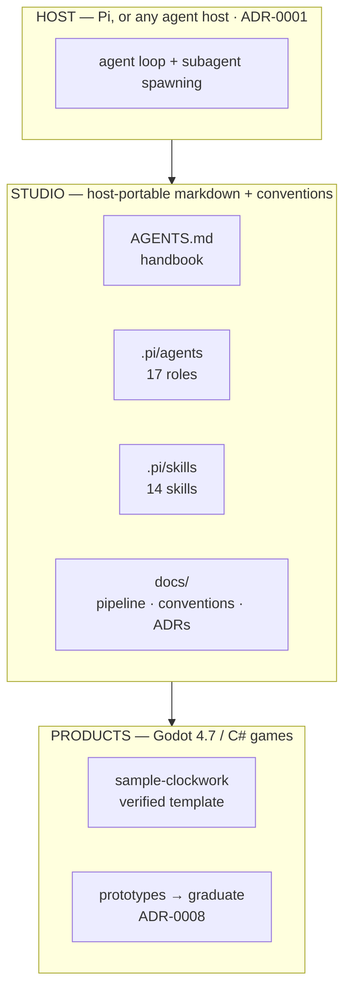
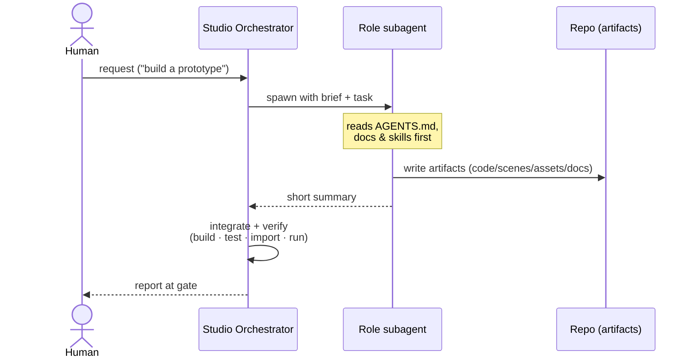

# Studio architecture

How the Fidgetfall **harness** is wired — distinct from any per-game
`docs/architecture.md` (which describes that game's code). Decisions here are
recorded as [ADRs](adr/README.md); this doc is the map that ties them together.

## The three layers

The studio layer is **host-portable** (ADR-0001): it is plain markdown + conventions,
so it runs under Pi *or* any host with an equivalent subagent mechanism. It has been
run end-to-end under Pi and under Claude Code (whose Agent tool stood in for Pi's
subagents).

## Orchestration model

- The **top-level session is the Studio Orchestrator** (Executive Producer). It
  clarifies the request, routes to roles, integrates artifacts, resolves
  cross-discipline conflicts, and reports at gate boundaries.
- **Roles are single-level subagents** (ADR-0002) with clean prompts; they read
  `AGENTS.md` + relevant docs/skills, do focused work, and write **artifacts to the
  repo** (not chat). Subagents do **not** nest — the Producer *recommends* routing,
  the Orchestrator *spawns*.
- Multi-phase work runs as **waves** the Orchestrator sequences (parallel where
  independent, serial across dependencies) — see the
  [orchestration playbook](orchestration-playbook.md).

## Roles & skills

- **17 roles** across Production, Design, Engineering, Art, Audio, Quality, Ops —
  defined in `.pi/agents/`, indexed with a routing table in [roles.md](roles.md).
- **14 skills** in `.pi/skills/` — Godot/C# capabilities (setup, scripting, scenes,
  input, resources, shaders, audio, testing, export, the 2D platformer kit) plus
  design (`game-design-doc`) and the three asset tiers (ADR-0005). Some skills ship
  **committed generator tools** (`synth-sfx.mjs`, `credit-asset.mjs`). Each role
  brief preloads its skills via `skills:` frontmatter (pi-subagents injects the
  SKILL.md content into the role's prompt).

## Engineering spine (per game)

- Godot 4.7 + C#, target **net8.0** (ADR-0003).
- **Pure logic separated from Node glue** (ADR-0004): testable `src/core/`, thin Node
  views, tunables via `[Export]`/`.tres`.
- **Tests favor pure logic**; headless scene tests are avoided as unstable (ADR-0006).
- **Assets** follow the three-tier strategy and placeholder-first policy (ADR-0005,
  0007), with license provenance in `CREDITS.md`.

## Verification

The studio treats "done" as **verified**, not asserted. For any game change the
Orchestrator runs: `dotnet build` (clean) → `dotnet test` (green) → `godot --headless
--import` (clean) → `godot --headless --quit-after N` (exit 0, no script errors). CI
is the next step to make this automatic on push.

## Where to look

| Want to know… | Read |
|---|---|
| Who does what / how to delegate | [roles.md](roles.md) |
| How a game goes pitch → release | [pipeline.md](pipeline.md) |
| Code standards | [conventions.md](conventions.md) |
| Why a decision was made | [adr/](adr/README.md) |
| How to run a full production | [orchestration-playbook.md](orchestration-playbook.md) |
| Setup / install | [../BOOTSTRAP.md](../BOOTSTRAP.md) |
