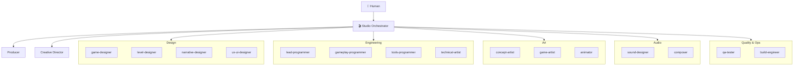

# Roles & delegation guide

Every role is a Pi subagent in [`.pi/agents/`](../.pi/agents). The Studio
Orchestrator (top-level session) picks the most specific role for each request.
Use this as the routing table.

## Routing by intent

| If the ask is about… | Delegate to | `subagent_type` |
|---|---|---|
| "Is this worth making? what's the vibe?" | Creative Director | `creative-director` |
| Planning, scheduling, "what's next", milestones | Producer | `producer` |
| Mechanics, systems, balance, the GDD | Game Designer | `game-designer` |
| Level layout, pacing, whiteboxing | Level Designer | `level-designer` |
| Story, lore, dialogue, quests | Narrative Designer | `narrative-designer` |
| Menus, HUD, flows, accessibility | UX/UI Designer | `ux-ui-designer` |
| Architecture, code standards, performance, reviews | Lead Programmer | `lead-programmer` |
| Implementing gameplay/entities in C# | Gameplay Programmer | `gameplay-programmer` |
| Editor plugins, importers, automation | Tools Programmer | `tools-programmer` |
| Shaders, VFX, rendering, materials | Technical Artist | `technical-artist` |
| Visual direction, style guide, asset briefs | Concept Artist | `concept-artist` |
| Producing/integrating sprites, models, placeholders | Game Artist | `game-artist` |
| Animation, rigging, game-feel timing | Animator | `animator` |
| SFX design, audio buses, mixing | Sound Designer | `sound-designer` |
| Music, adaptive scoring | Composer | `composer` |
| Test plans, automated tests, bug reports | QA Tester | `qa-tester` |
| Builds, exports, CI/CD, releases | Build Engineer | `build-engineer` |

## Org chart

## Delegation tips
- Prefer the **most specific** role. Overlaps (e.g. tech-art vs gameplay) → Producer arbitrates.
- Spawn multiple roles **in parallel** when work is independent (e.g. designer specs
  while artist drafts placeholders).
- Give each subagent the **artifact paths** it needs; roles start from a clean prompt
  and read `AGENTS.md` + relevant `docs/` themselves.
- The Orchestrator integrates outputs and reports at gate boundaries — it doesn't
  silently do specialist work unless no role fits.
